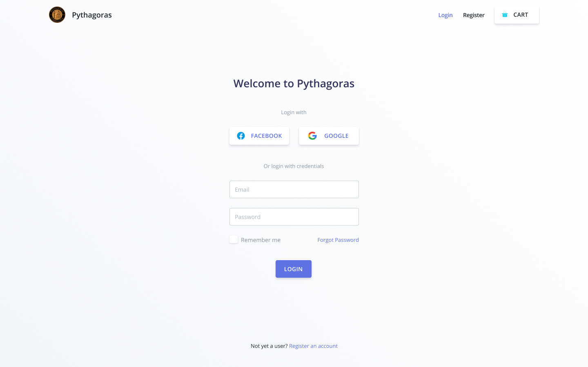
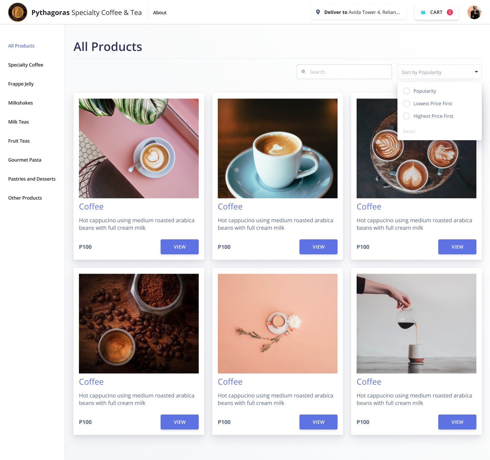
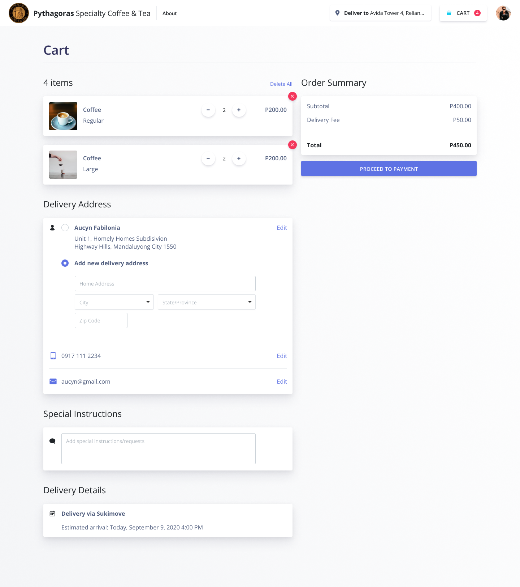
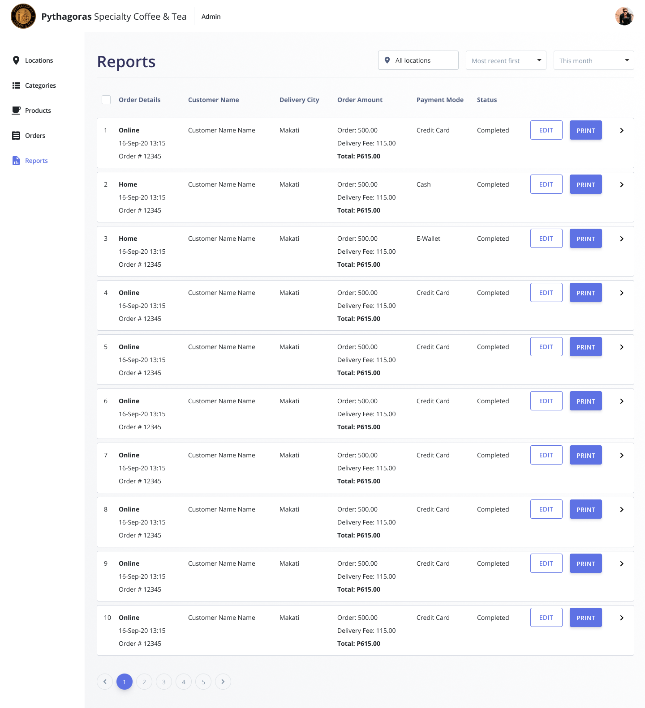

# Pythagoras Web

_October 11, 2020_

This is a commisioned build for [Pythagoras Coffee & Tea](https://www.facebook.com/PythagorasCoffeeTea), an Ecommerce website that aims to provide their products online created with NextJS.

A demo of the build is deployed [here](https://pythagoras.netlify.app).

### Technologies used

- NextJS - Front-end
- MongoDB - Backend
- Sass - Styling

Here are some Screenshots of the application. [See More](https://www.figma.com/file/4d4JcUfN3zkl4FWRTlc4Gb/Pythagoras).

 
<strong>Login Screen</strong>

 
<strong>Main Dashboard for Shoppers</strong>

 
<strong>Shopper Cart</strong>

 
<strong>Admin Reports</strong>

    
COPYRIGHT © 2020

    
Pythagoras Coffee & Tea, All Rights Reservered

